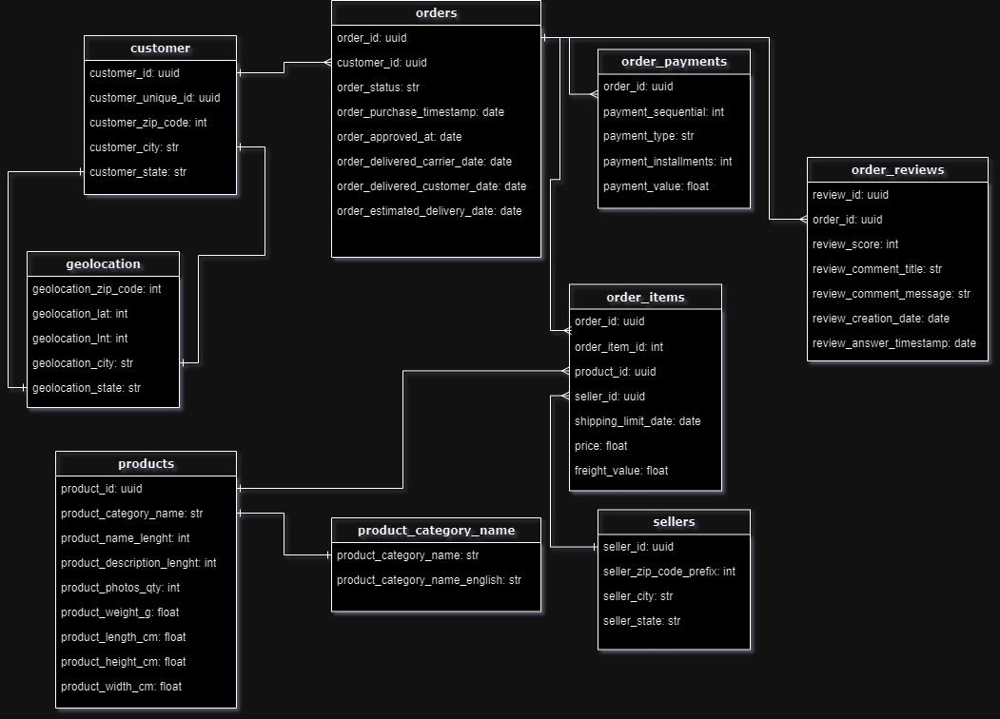
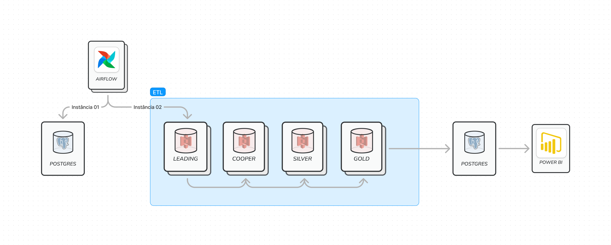

# Sobre o Projeto de Pipeline

## Construção do Projeto

### 1. Coleta de Dados

- Como mencionado na pagina _Home_ utilizamos o seguinte _[Dataset](https://www.kaggle.com/datasets/olistbr/brazilian-ecommerce)_ para manipulação de dados, segue o diagrama relacional:



- Utilizamos o airflow para iniciar a coleta dos dados de um banco relacional, com objetivo de popular a camada de _Landing_.

```bash
Codigo aqui
```

### 2. Processamento de Dados

- O processamento segue o seguinte fluxo:
  <br>



- Começando pela camada Landing:
  <br>

#### Camada _Landing_

Com o código abaixo iniciamos uma sessão Spark utilizando Delta Lake.

```bash
# Iniciando uma SparkSession com Delta Lake
spark = SparkSession.builder \
    .appName("DeltaLakeSparkS3") \
    .config("spark.sql.extensions", "io.delta.sql.DeltaSparkSessionExtension") \
    .config("spark.sql.catalog.spark_catalog", "org.apache.spark.sql.delta.catalog.DeltaCatalog") \
    .getOrCreate()
```

- Como comentado na _Home_ estamos utilizando **Amazon S3**.

```bash
# Função para ler dados do S3
def read_from_s3(bucket, path):
    try:
        df = spark.read.format("csv").option("header", "true").load(f"s3a://{bucket}/{path}")
        return df
    except Exception as e:
        print(f"Erro ao ler dados do S3: {e}")
```

- Depois de realizado a leitura, salvamos os dados em formato _PARQUET_ e direcionamos os dados para a camada **Bronze**.

```bash
# Função principal
def main():
    try:
        # Definindo os caminhos dos arquivos CSV na landing
        paths = ['geo.csv', 'dadosprodutos.csv', 'pedidos.csv', 'clientes.csv', 'vendedores.csv', 'pagamentos.csv', 'dadospedidos.csv']
        dfs = {}
        for path in paths:
            df_name = path.split('.')[0]
            dfs[df_name] = read_from_s3(landing_bucket, f"/{path}")

        # Salvando os DataFrames no formato Parquet usando Delta Lake no bucket da camada bronze
        for df_name, df in dfs.items():
            df.write.format("delta").mode('overwrite').save(f"s3a://{bronze_bucket}/{df_name}")

        print("Dados salvos na camada bronze com sucesso.")

    except Exception as e:
        print(f"Erro no processo principal: {e}")

if __name__ == "__main__":
    main()
```

<hr>

#### Camada _Bronze_

Agora os dados se encontram na camada _Bronze_.
<br>

- Como iniciamos outro processo é necessario iniciar outra sessão Spark.

```bash
# Iniciando uma SparkSession com Delta Lake
spark = SparkSession.builder \
    .appName("BronzeLayer") \
    .config("spark.sql.extensions", "io.delta.sql.DeltaSparkSessionExtension") \
    .config("spark.sql.catalog.spark_catalog", "org.apache.spark.sql.delta.catalog.DeltaCatalog") \
    .getOrCreate()
```

- Agora carregamos os dados para a camada _Bronze_.

```bash
  # Carregar arquivos Delta da camada bronze
  localizacoes = spark.read.format("delta").load(f'{bronze_bucket}/localizacoes')
  produtos = spark.read.format("delta").load(f'{bronze_bucket}/dadosprodutos')
  pedidos = spark.read.format("delta").load(f'{bronze_bucket}/pedidos')
  clientes = spark.read.format("delta").load(f'{bronze_bucket}/clientes')
  vendedores = spark.read.format("delta").load(f'{bronze_bucket}/vendedores')
  pagamentos = spark.read.format("delta").load(f'{bronze_bucket}/pagamentos')
  dadospedidos = spark.read.format("delta").load(f'{bronze_bucket}/dadospedidos')
```

- Renomeamos as colunas.

```bash
  # Renomear colunas
  clientes = clientes.withColumnRenamed('idgeralcliente', 'idcliente')
  produtos = produtos.withColumnRenamed('id_produto', 'idproduto')
```

- Criação da tabela dimensional **DIM_DATA** e utilizando ela para criar os **DataFrames**.

```bash
  # CRIA DIM_DATA

  # Gerar uma lista de datas de 2015 até hoje + 1 dia
  end_date = datetime.now() + timedelta(days=1)
  dates = [end_date - timedelta(days=x) for x in range((end_date - datetime(2015, 1, 1)).days + 1)]

  # Criar um DataFrame com as datas
  schema = StructType([
      StructField('dt_data', StringType(), True)
  ])
  df = spark.createDataFrame([(d.strftime('%Y-%m-%d'),) for d in dates], schema=schema)

  df = df.withColumn('dt_diasemana', dayofweek(col('dt_data')))
  df = df.withColumn('dt_diasemana_ord', dayofweek(col('dt_data')))
  df = df.withColumn('dt_mesano', col('dt_data').substr(0, 7))
  df = df.withColumn('dt_mesano_ord', (year(col('dt_data')) - 2015) * 12 + month(col('dt_data')))
  df = df.withColumn('dt_trimestre', quarter(col('dt_data')))
  df = df.withColumn('dt_trimestre_ord', (year(col('dt_data')) - 2015) * 4 + quarter(col('dt_data')))
  df = df.withColumn('dt_ano', year(col('dt_data')))
  df = df.withColumn('sk_data', year(col('dt_data')))
```

- Necessario reorganizar as colunas para o **formato especificado**.

```bash
  # Reorganizar as colunas conforme o formato especificado
  datas = df.select('sk_data', 'dt_data', 'dt_diasemana', 'dt_diasemana_ord', 'dt_mesano', 'dt_mesano_ord', 'dt_trimestre', 'dt_trimestre_ord', 'dt_ano')
```

- Criação da tabela dimensional **DIM_PEDIDOS**. Logo em seguida salvamos na camada _Silver_.

```bash
### CRIA PEDIDOS ###

temp = pedidos.join(dadospedidos, on='idpedido', how='left') \
    .join(pagamentos, on='idpedido', how='left') \
    .join(vendedores, on='idvendedor', how='left') \
    .join(clientes, on='idcliente', how='left') \
    .join(produtos, on='idproduto', how='left')

temp.show()
temp.filter(temp['cepcliente'].isNotNull()).show()

### SALVAR TABELAS NA CAMADA SILVER ###

temp.write.format("delta").mode('overwrite').save(f'{silver_bucket}/pedidos')
localizacoes.write.format("delta").mode('overwrite').save(f'{silver_bucket}/localizacoes')
datas.write.format("delta").mode('overwrite').save(f'{silver_bucket}/dim_data')
```

<hr>

#### Camada _Silver_

Entrando na camada _Silver_.
<br>

- Nova camada, nova sessão Spark.

```bash
# Iniciando uma SparkSession com Delta Lake
spark = SparkSession.builder \
    .appName("SilverLayer") \
    .config("spark.sql.extensions", "io.delta.sql.DeltaSparkSessionExtension") \
    .config("spark.sql.catalog.spark_catalog", "org.apache.spark.sql.delta.catalog.DeltaCatalog") \
    .getOrCreate()
```

- Carregando os dados na camada _Silver_.

```bash
  # Carregar arquivos Delta da camada silver
  datas = spark.read.format("delta").load(f'{silver_bucket}/dim_data')
  pedidos = spark.read.format("delta").load(f'{silver_bucket}/pedidos')
  localizacoes = spark.read.format("delta").load(f'{silver_bucket}/localizacoes')
```

-

```bash

```

<!-- ### 3. Automação

- O carregamento de dados na pipeline é realizado automaticamente por meio do método airflow.
  <br>
  **Explicação:**

  **Exeplo:**

```bash
Codigo aqui
``` -->
